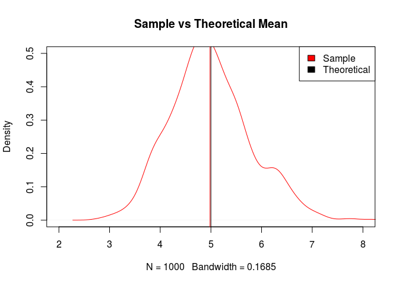
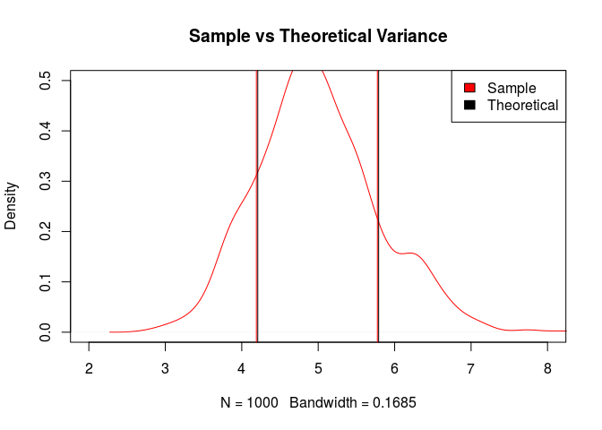
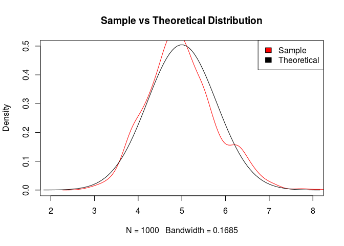

# Comparison of the Exponential Distribution with the Central Limit Theorem
Glen Greer, December 2015; Statistical Inference - Simulation Exercise  

# Overview

The Central Limit Theorem (CLT) states that the distribution of averages of _iid_ variables (properly normalized) becomes that of a standard normal as the sample size increases.  We demonstrate this by taking a large number of samples of the exponential distribution, and compare the sample mean and variance with their theoretical values.

# Simulations

To investigate the exponential distribution we use $rexp(n, \lambda)$ where $\lambda$ is the rate parameter.  We set $\lambda = 0.2$ and use a sample size of $40$ for all of the simulations. We run $1000$ simulations and calculate the mean from each.


```r
lambda <- 0.2; n_sample <- 40; n_simulations <- 1000
exp_means <- NULL
for (i in 1 : n_simulations)
    exp_means <- c(exp_means, mean(rexp(n = n_sample, rate = lambda)))
```

# Sample Mean vs Theoretical Mean

The theoretical mean of the sample distribution is that of the population mean which is $\frac{1}{\lambda}$ for the exponential distribution.


```r
theo_mean <- 1/lambda

plot(density(exp_means), col = "red", xlim = c(2,8), ylim = c(0,0.5),
     main = "Sample vs Theoretical Mean")
abline(v = mean(exp_means), col = "red")
abline(v = theo_mean, col = "black")
legend("topright", legend = c("Sample", "Theoretical"), fill = c("red", "black"))
```

 

This plot shows the sample mean of 4.9828386 which closely approximates the theoretical mean of 5 for our exponential distribution where $\lambda = 0.2$.

# Sample Variance vs Theoretical Variance

The theoretical standard deviation of the sample distribution is $\frac{1}{\sqrt{n}}$ times the population's standard deviation of $\frac{1}{\lambda}$ for the exponential distribution.


```r
theo_sd <- 1/sqrt(n_sample) * 1/lambda

x <- theo_mean + seq(-4, 4, length = 100) * theo_sd
y <- dnorm(x, theo_mean, theo_sd)

plot(density(exp_means), col = "red", xlim = c(2,8), ylim = c(0,0.5),
     main = "Sample vs Theoretical Variance")
abline(v = mean(exp_means)+c(-1,1)*sd(exp_means), col = "red")
abline(v = theo_mean+c(-1,1)*theo_sd, col = "black")
legend("topright", legend = c("Sample", "Theoretical"), fill = c("red", "black"))
```

 

As with the means, the variance is also close with the sample standard distribution of 0.7914296 compared to 0.7905694, our estimated theoretical value.

# Distribution

The Central Limit Theorm states that the sample distribution should approximate a normal distribution. Using our theoretical values, we overlay a normal distribution over our sample distribution to compare them.


```r
x <- theo_mean + seq(-4, 4, length = 100) * theo_sd
y <- dnorm(x, theo_mean, theo_sd)

plot(density(exp_means), col = "red", xlim = c(2,8), ylim = c(0,0.5),
     main = "Sample vs Theoretical Distribution")
lines(x, y, col = "black")
legend("topright", legend = c("Sample", "Theoretical"), fill = c("red", "black"))
```

 

The normal distribution approximates the sample distribution in this example.
