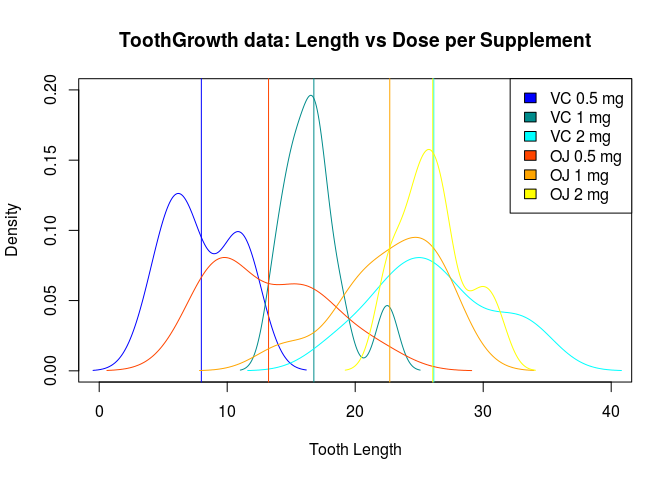

# Inferential Data Analysis of Tooth Growth Data
Glen Greer, December 2015; Statistical Inference - Inferential Data Analysis  

# Overview

The ToothGrowth data set contains length measurements of teeth for guinea pigs given 0.5, 1 and 2 mg doses of Vitamin C supplements via orange juice (OJ) and ascorbic acid (VC).

Inferential data analysis is done on this data by performing hypothesis testing and confidence intervals to compare dose and supplement effectiveness using Student's T-tests.

# Analysis

First we load the data, and initialize variables for plotting.


```r
data("ToothGrowth")

cols <- c("blue", "darkcyan", "cyan", "orangered", "orange", "yellow")
means <- NULL
vars <- NULL
legend <- NULL
col <- 1
```

Next we plot densities of length for each dosage amount with each supplement, along with the mean value for comparison.


```r
plot(c(0,40),c(0,0.2), type="n",
     main = "ToothGrowth data: Length vs Dose per Supplement",
     xlab = "Tooth Length", ylab = "Density")
for(i in c("VC", "OJ")) for(j in c(0.5,1,2)) {
    supp_dose <- ToothGrowth[ToothGrowth$supp == i & ToothGrowth$dose == j, ]$len
    lines(density(supp_dose), col = cols[col])
    abline(v = mean(supp_dose), col = cols[col])
    means <- c(means, mean(supp_dose))
    vars <- c(vars, round(var(supp_dose), 3))
    legend <- c(legend, paste(i, j, "mg"))
    col <- col + 1
}
legend("topright", legend = legend, fill = cols)
```

 

We put the means and variances in a table to relate what is shown in the plot.


```r
cbind(legend, means, vars)
```

```
##      legend      means   vars    
## [1,] "VC 0.5 mg" "7.98"  "7.544" 
## [2,] "VC 1 mg"   "16.77" "6.327" 
## [3,] "VC 2 mg"   "26.14" "23.018"
## [4,] "OJ 0.5 mg" "13.23" "19.889"
## [5,] "OJ 1 mg"   "22.7"  "15.296"
## [6,] "OJ 2 mg"   "26.06" "7.049"
```

Analyzing the data it appears that lower dosages tend towards shorter tooth growth, and higher dosages tend towards longer tooth growth.  We also observe a large amount of variance in the data.

# Confidence Intervals and Hypothosis Tests

## Testing Dosage Amount

Since the data varies widely, we test dosage using `var.equal = FALSE`.  An assumption is made that these tests were done with independent test subjects so we use `paired = FALSE`.


```r
ldose_t <- t.test(len ~ dose, data = ToothGrowth[ToothGrowth$dose != 2.0,],
                  paired = FALSE, var.equal = FALSE)
ldose_t
```

```
## 
## 	Welch Two Sample t-test
## 
## data:  len by dose
## t = -6.4766, df = 37.986, p-value = 1.268e-07
## alternative hypothesis: true difference in means is not equal to 0
## 95 percent confidence interval:
##  -11.983781  -6.276219
## sample estimates:
## mean in group 0.5   mean in group 1 
##            10.605            19.735
```

```r
hdose_t <- t.test(len ~ dose, data = ToothGrowth[ToothGrowth$dose != 0.5,],
                  paired = FALSE, var.equal = FALSE)
hdose_t
```

```
## 
## 	Welch Two Sample t-test
## 
## data:  len by dose
## t = -4.9005, df = 37.101, p-value = 1.906e-05
## alternative hypothesis: true difference in means is not equal to 0
## 95 percent confidence interval:
##  -8.996481 -3.733519
## sample estimates:
## mean in group 1 mean in group 2 
##          19.735          26.100
```

The confidence intervals found testing low and high dosages are $[-11.984, -6.276]$ and $[-8.996, -3.734]$  respectively and do not contain zero, therefore we accept the null hypothesis and can correlate tooth length with dosage (higher dosage leads to longer teeth).

## Testing Supplement Type

The supplement data similarly varies with independent test subjects, so we test again using `var.equal = FALSE` and `paired = FALSE`.


```r
supp_t <- t.test(len ~ supp, data = ToothGrowth,
                 paired = FALSE, var.equal = FALSE)
supp_t
```

```
## 
## 	Welch Two Sample t-test
## 
## data:  len by supp
## t = 1.9153, df = 55.309, p-value = 0.06063
## alternative hypothesis: true difference in means is not equal to 0
## 95 percent confidence interval:
##  -0.1710156  7.5710156
## sample estimates:
## mean in group OJ mean in group VC 
##         20.66333         16.96333
```

The confidence interval of $[-0.171, 7.571]$ contains zero, therefore we reject the null hypothesis and cannot correlate tooth length with supplement type.

# Conclusion

Assuming that tooth growth in gerbils is normally distributed, and that the samples provided estimate the population we can conclude that a higher dose of 2 mg of vitamin C will result in longer tooth growth.
